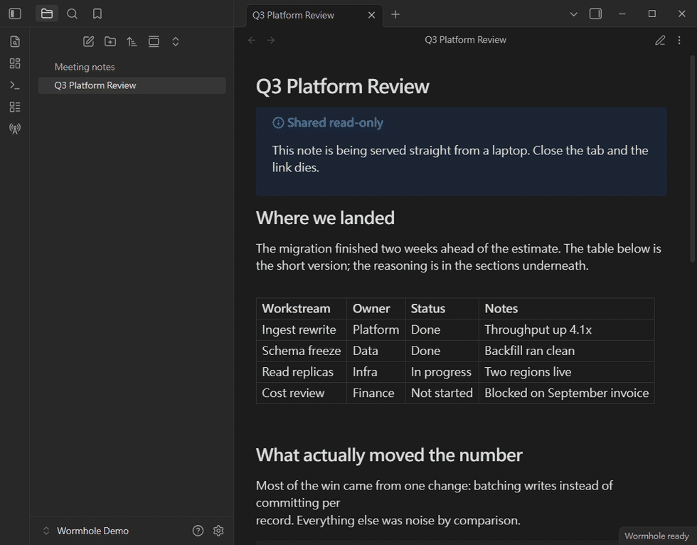
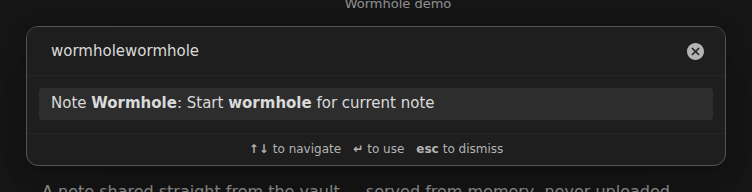
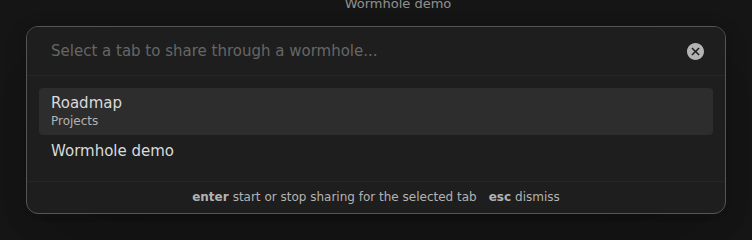
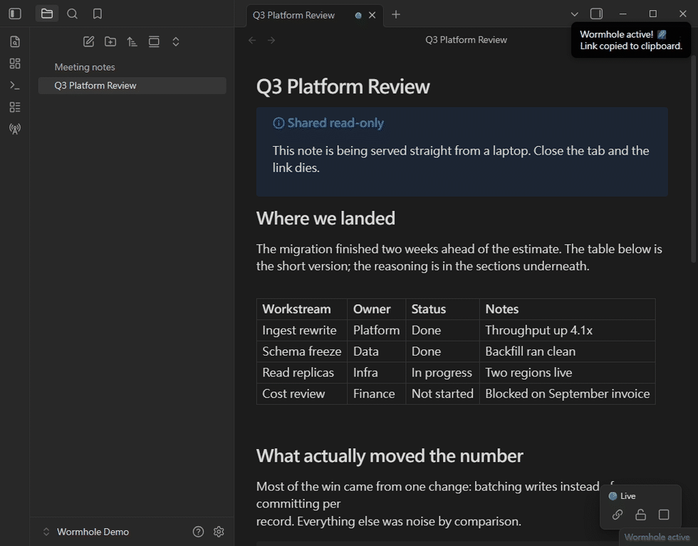
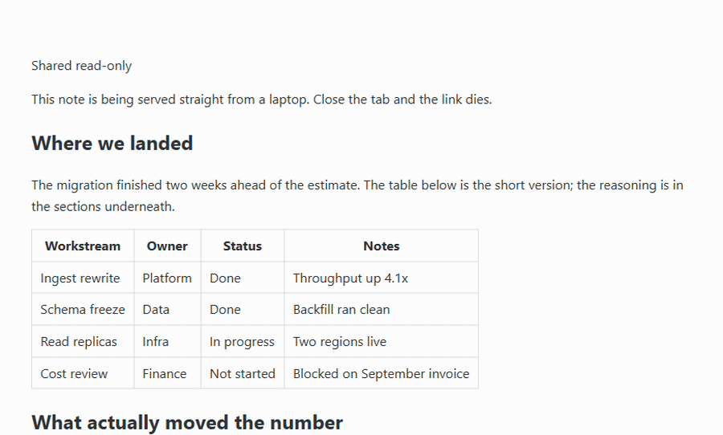
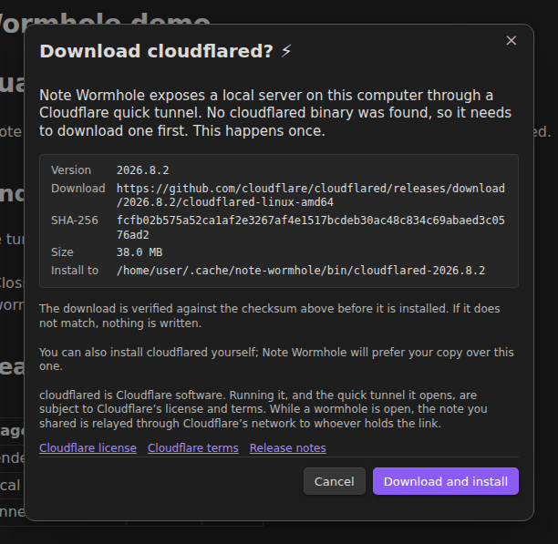
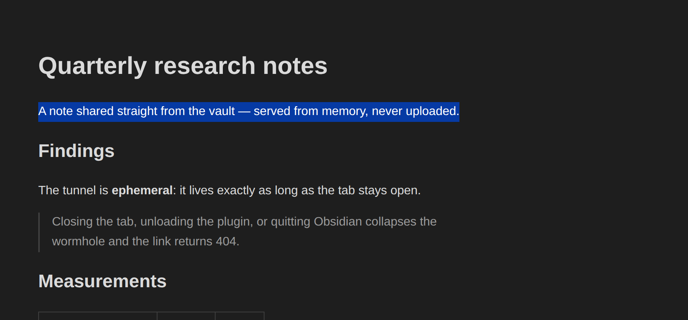
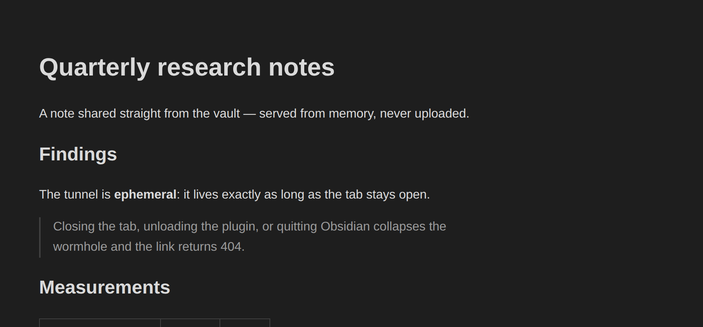
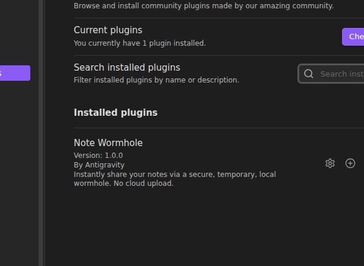

# Note Wormhole

Instantly share your notes via a secure, temporary, local wormhole. No cloud upload.

Note Wormhole turns your machine into a temporary web server for a single note, and exposes it through a Cloudflare quick tunnel. Close the tab, disable the plugin, or quit the app, and the link is dead.



## Features

- **Ephemeral sharing** — a public `https://<random>.trycloudflare.com` URL tunnels straight to your computer.
- **No cloud upload** — the note is rendered into memory and served from there. Nothing is written to a temp file, and nothing is stored on a third-party server.
- **Bound to the tab** — closing the note's tab, unloading the plugin, or quitting immediately tears down the tunnel and the local server.
- **Anti-copy mode** — optionally disable text selection, the context menu, and copy/print shortcuts for visitors.
- **Live viewer count** — see how many people currently have the page open.

## Usage

### Opening a wormhole

1. Open the note you want to share.
2. Click the **radio tower** icon in the ribbon, or run the **Start wormhole for current note** command.
3. On first use you'll be asked to confirm what sharing exposes (see [Network use](#network-use) below). You need [`cloudflared` installed](#requires-cloudflared).
4. The link is copied to your clipboard, and a green dot appears in the tab header.

Both commands are in the command palette:



The ribbon icon opens a picker, so you can share any open tab rather than just the
active one. Tabs that are already live are flagged:



### Controlling a session

- **Hover** the green dot to see the viewer count.
- **Click** the green dot (or press <kbd>Enter</kbd> when it has focus) for the menu:
  - **Copy link** — get the URL again.
  - **Prevent selection / Unlock selection** — toggle anti-copy for this session.
  - **Stop sharing** — collapse the wormhole.
- The **floating panel** in the bottom-right of the note offers the same controls.
- The **status bar** item shows how many wormholes are open; click it to toggle the current note.

The viewer count is live — it goes up as readers open the page, and the session ends the moment
you stop it:



## What the reader sees

The note is re-rendered into a standalone page. The **Theme mode** setting decides whether
visitors get light, dark, or whatever their own system prefers — and with **Prevent text
selection** on, dragging across the page selects nothing:



## Requires cloudflared

Note Wormhole opens its tunnel by running Cloudflare's [`cloudflared`](https://github.com/cloudflare/cloudflared).
**You install it; the plugin never downloads or installs it for you.** Without it, sharing does
not work — the same arrangement as Obsidian plugins that drive `pandoc`, `ffmpeg` or `git`.

| Platform | Install with |
| --- | --- |
| Windows | `winget install Cloudflare.cloudflared`, or the `.exe`/`.msi` from [releases](https://github.com/cloudflare/cloudflared/releases/latest) |
| macOS | `brew install cloudflared` |
| Linux | [Cloudflare's package repository](https://pkg.cloudflare.com/), or the `.deb`/`.rpm` from [releases](https://github.com/cloudflare/cloudflared/releases/latest) |

Cloudflare's own [installation guide](https://developers.cloudflare.com/cloudflare-one/connections/connect-networks/downloads/)
covers every platform.

The plugin's settings tab tells you whether it was found, shows which copy will be run, and
gives the install command for your platform when there is none. Detection runs again on every
share, so no restart is needed after installing — and on Windows it also checks winget's install
location directly, because a running Obsidian keeps the `PATH` it started with.

### Files it reads outside your vault

To find `cloudflared`, the plugin looks on your `PATH` and in the standard install locations for
your platform — `/opt/homebrew/bin`, `/usr/local/bin`, `/usr/bin`, `/snap/bin`, `~/.cloudflared`
and `~/.local/bin` on macOS and Linux, and the `cloudflared` folder under `Program Files` on
Windows. It runs `cloudflared --version` on a candidate to confirm it really is cloudflared
before spawning it. That is the only thing Note Wormhole reads from outside the vault, and it
writes nothing outside the vault at all.

## Network use

Before installing, understand what this plugin does on the network:

| What | Where to | When |
| --- | --- | --- |
| Runs your `cloudflared` as a child process | — | While a wormhole is open |
| Relays note content through a Cloudflare quick tunnel | Cloudflare's edge network | While a wormhole is open |
| Serves the note over HTTP | `127.0.0.1` only, on an OS-assigned port | While a wormhole is open |

The plugin makes no other network requests. There is no telemetry, no account, and no server of
ours anywhere in the path.

The tunnel is a Cloudflare **quick tunnel**: no Cloudflare account or token is required, the URL
is randomly assigned, and the service is subject to
[Cloudflare's terms](https://www.cloudflare.com/terms/).

Before the first share, the plugin spells out what that exposes and asks you to confirm:



## Security and privacy

- The local HTTP server binds to `127.0.0.1` on an OS-assigned port; it is only reachable through the tunnel.
- The server answers `/` (the note) and `/_heartbeat` (viewer counting). Everything else returns 404.
- The rendered HTML is held in memory only — it is never written to disk.
- Responses are sent with `no-store`, a restrictive `Content-Security-Policy`, `X-Robots-Tag: noindex`, and `Referrer-Policy: no-referrer`.
- Ending a session destroys the tunnel and force-closes every open socket, so the URL dies immediately.

Side by side, the same drag across the same paragraph, with anti-copy off and on:

| Selection allowed | Anti-copy mode |
| --- | --- |
|  |  |

**Anti-copy mode is a deterrent, not protection.** It disables selection, the context menu, and the copy/print shortcuts, but anyone who wants the text can still read the page source. Do not treat it as a security control.

**Anyone with the URL can read the note** while the session is open. There is no password or access list.

## Requirements

- **Desktop only.** The plugin runs a local Node.js HTTP server and a child process, which Obsidian mobile does not support.
- **Obsidian 1.5.1 or newer.**
- **[`cloudflared`](#requires-cloudflared) installed on your machine.** The plugin does not install it.
- **An internet connection** to establish the tunnel.

## Installation

### From Community Plugins

1. Open **Settings → Community plugins** and search for "Note Wormhole".
2. Install and enable it.

On first run you get a short introduction, once:



### Manual

1. Download `main.js`, `manifest.json`, and `styles.css` from the [latest release](https://github.com/VaalRL/obsidian-note-wormhole/releases/latest).
2. Copy them into `<your vault>/.obsidian/plugins/note-wormhole/`.
3. Reload Obsidian and enable the plugin.

## Development

```bash
npm install
npm run dev     # watch build
npm run build   # typecheck + production bundle
npm test        # install guidance, path control, tunnel URL parsing
npm run lint
```

The plugin has no runtime dependencies, and ships no binaries. It runs whatever `cloudflared`
it finds on the machine; see [`src/services/CloudflaredBinaryService.ts`](src/services/CloudflaredBinaryService.ts)
for the detection, and [`src/services/cloudflaredInstall.ts`](src/services/cloudflaredInstall.ts)
for the guidance shown when there is none.

## License

MIT. See [LICENSE](LICENSE).
