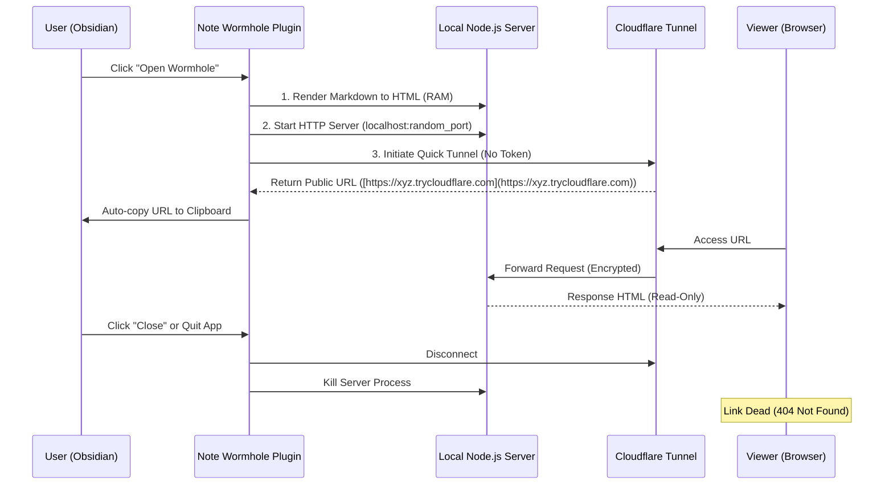

# Product Requirements Document (PRD): Note Wormhole

| Document Info | Details |
| :--- | :--- |
| **Project Name** | **Note Wormhole** |
| **Version** | 1.0.0 (MVP) |
| **Core Concepts** | **Wormhole Technology** (Tunneling), **Ephemeral** (Short-lived), **Anti-Copy** (Protection) |
| **Platform** | Obsidian (Desktop) Plugin |
| **Slogan** | *"Open a wormhole from your vault to the web. Close it, and it's gone."* |

---

## 1. Product Overview

### 1.1 Product Definition
**Note Wormhole** is an Obsidian plugin that instantly transforms the user's local machine into a temporary web server. Utilizing Cloudflare Tunnel technology, it generates a public HTTPS URL for read-only note sharing without exposing the user's real IP address.

### 1.2 Core Value Proposition
1.  **Physical Control**: The lifecycle of the link is bound to the user's physical presence. Closing the plugin or the laptop causes the "wormhole" to collapse, making the link immediately invalid (404).
2.  **Privacy First**: No data is uploaded to third-party cloud storage. Content is streamed directly from RAM via an encrypted tunnel.
3.  **Reader Centric**: Designed for "Broadcast" rather than "Collaboration." Provides a clean reading interface with optional anti-copy protection.

---

## 2. System Architecture

### 2.1 Logic Flow (Sequence Diagram)



### 2.2 Data Flow & Security
* **Initialization**: Markdown -> HTML (Stored in RAM) -> Localhost Server -> Tunnel Created.
* **Access**: Visitor -> Cloudflare Edge -> Tunnel -> Localhost -> HTML Response.
* **Termination**: User Stop -> Tunnel Destroyed -> URL Dead.

---

## 3. Functional Requirements

### 3.1 Core Features (MVP)

| ID | Feature | Description | Priority |
| :--- | :--- | :--- | :--- |
| **F-01** | **Open Wormhole** | Activate local server and tunnel via Ribbon Icon or Command Palette. | **P0** |
| **F-02** | **Secure Tunneling** | Automatically establish Cloudflare Quick Tunnel; hide Origin IP; generate HTTPS URL. | **P0** |
| **F-03** | **Live Rendering** | Convert current note to HTML, supporting basic Obsidian syntax (Callouts, Tables, Quotes). | **P0** |
| **F-04** | **Auto-Copy** | Automatically copy the generated URL to the system clipboard upon success. | **P0** |
| **F-05** | **Kill Switch** | Mandatory process termination when Obsidian closes or the plugin is unloaded. | **P0** |
| **F-06** | **Status Indicator** | Status Bar: ⚪ Idle / 🟡 Opening... / 🟢 Live. | **P1** |

### 3.2 Security & Protection

| ID | Feature | Description | Priority |
| :--- | :--- | :--- | :--- |
| **S-01** | **Anti-Select Mode** | **(Key Setting)** Inject CSS to disable text selection and change cursor to default, preventing easy copying. | **P1** |
| **S-02** | **RAM Only** | Generated HTML exists only in memory variables. No writing to `temp` folders on disk. | **P0** |
| **S-03** | **Path Control** | Web Server responds ONLY to the root path `/`. All other paths return 403/404. | **P0** |

---

## 4. UI & Settings

### 4.1 Settings Tab

| Setting Key | Type | Default | Description |
| :--- | :--- | :--- | :--- |
| `preventSelection` | Toggle | `False` | **Anti-Copy Mode**: If enabled, visitors cannot select text with the mouse. |
| `themeMode` | Dropdown | `Auto` | Options: `Auto` (Match Obsidian), `Light`, `Dark`. |
| `showWatermark` | Toggle | `False` | (Future) Display a semi-transparent watermark on the background. |

### 4.2 Visual Feedback
* **Ribbon Icon**: Use an icon resembling a vortex, radar, or aperture (e.g., `radio-tower`).
    * *State: Off* -> Grey / Dimmed.
    * *State: On* -> Green / Active accent color.

---

## 5. Implementation Guide

### 5.1 Anti-Select CSS Injection
When `preventSelection` is `true`, inject the following CSS into the `<head>`:

```css
/* Anti-Select Injection */
.wormhole-protected {
    -webkit-user-select: none; /* Safari */
    -moz-user-select: none;    /* Firefox */
    -ms-user-select: none;     /* IE10+/Edge */
    user-select: none;         /* Standard */
    cursor: default;           /* Force default cursor instead of text-select cursor */
}
```

### 5.2 Tunneling (via `untun`)
Implementation snippet for `main.ts`:

```typescript
import { startTunnel } from 'untun';

async function openWormhole(port: number) {
    try {
        // Zero-config tunnel creation
        const tunnel = await startTunnel({ port: port });
        const url = await tunnel.getURL();
        return url;
    } catch (err) {
        console.error("Wormhole collapse:", err);
        throw err;
    }
}
```

---

## 6. Roadmap

* **Phase 1: MVP (Wormhole Prototype)**
    * Integrate Node.js `http` server + `untun`.
    * Implement basic Markdown -> HTML rendering.
    * Implement "Anti-Select" toggle.
* **Phase 2: Visuals**
    * Inject Obsidian CSS variables for native-like look.
    * Handle image assets (Base64 encoding).
* **Phase 3: Stability & Speed**
    * Tunnel pre-warming (optional).
    * Auto-reconnect logic.